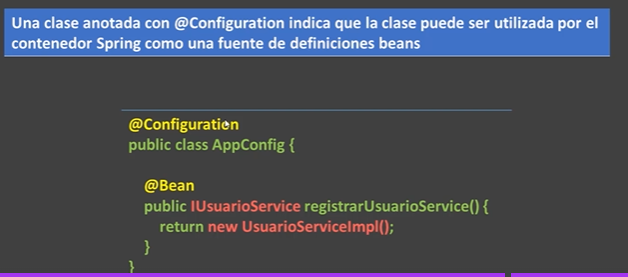

# Preguntas

- ¿Que es la inyención de dependencia?

    Es suministrar a un objeto una referencia de otros objetos que se necesite.

- ¿Qué son los beans en Spring?

# Anotaciones

- @Component ->

- @Configuration y @Bean ->

- @Autowired -> Especifica  que se inyentara  un objeto de Spring (bean o componente) en un atributo de otro objeto. Ya tienes la instacia creada sin necesidad de poner el `new`.

Inyenccion mediante Atributos (Obligatorio poner @Autowired)

Inyenccion mediante el metodo Setter (Obligatorio poner @Autowired)

Inyenccion mediante el constructor (No hace falta el @Autowired)

- @Primary -> Se usa cuando tenemos mas de una clase que implementan la misma interfaz y queremos decirle a Spring la que queremos usar (cual es la principal), usamos la anotación `@Primary`

  Sin @Primary
  
  
  
  Con @Primary
  
  

- @Qualifier -> Si tenemos alguna clase como primary y queremos usar un beans especifico. 

  

- @RequestScope -> en Spring crea una nueva instancia de un bean para cada solicitud HTTP. Esto significa que cada solicitud obtiene su propia instancia del bean, y esa instancia se destruye al finalizar la solicitud. Es útil para manejar datos específicos de una única solicitud.

- @SessionScope -> en Spring crea una instancia de un bean por cada sesión de usuario. Esto significa que la misma instancia del bean se mantiene y se comparte durante toda la duración de la sesión del usuario, hasta que la sesión expire o se cierre. Es útil para almacenar datos que deben persistir durante toda la sesión, como información de autenticación o carritos de compras.